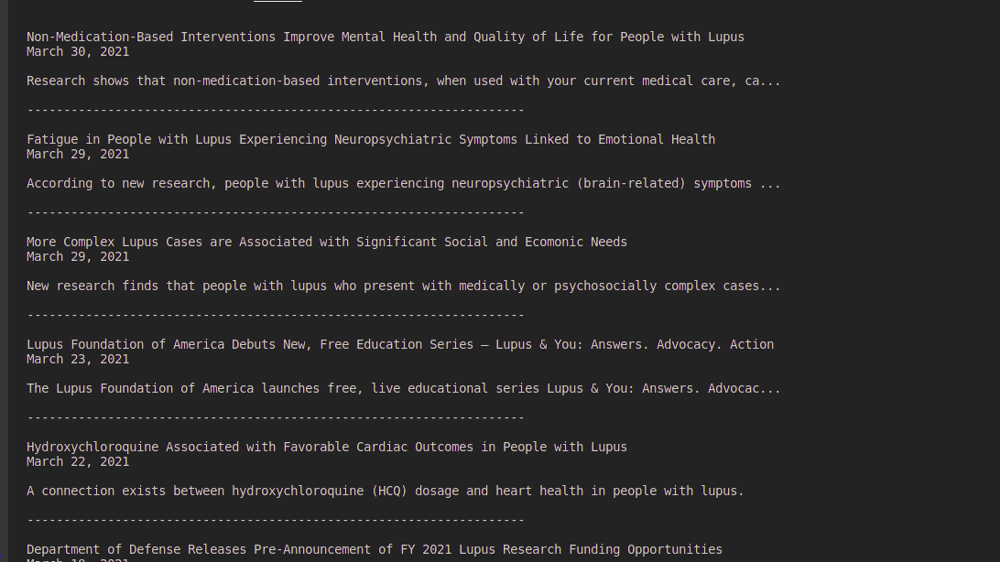

# Health News Web scraper

> This is a simple web scraper to extract the latest health news from lupus.org website.

>SLE lupus is an autoimmune disease that affects mostly women in their productive years. It is relatively unknown but quite common. The lupus.org website is dedicated to providing vital information on medication, latest research news, lifestyle tips and other resources to the over five (5) million sufferers of lupus globally. This application aims to extract latest news title, date and summary from the website.

## Built With
- Ruby

### Installations
-Run `bundle install` from root folder

### Usage
To get a local copy up and running follow these simple example steps.

-Clone the master repository on your system locally by running this command : git@github.com:JulianaOsemeke/healthnews_scraper.git

-cd <healthnews_scraper>

-Run bin/main

### Tests
- Run rspec in terminal

## Author

👤 **Juliana Osemeke**

- Github: 
- Twitter: 
- Linkedin: 

## 🤝 Contributing

Contributions, issues, and feature requests are welcome!

Feel free to check the [issues page](../../issues/).

## Show your support

Give a ⭐️ if you like this project!

## Acknowledgments

- Hat tip to anyone whose code was used
- Inspiration
- etc

## 📝 License

This project is [MIT](./MIT.md) licensed.
